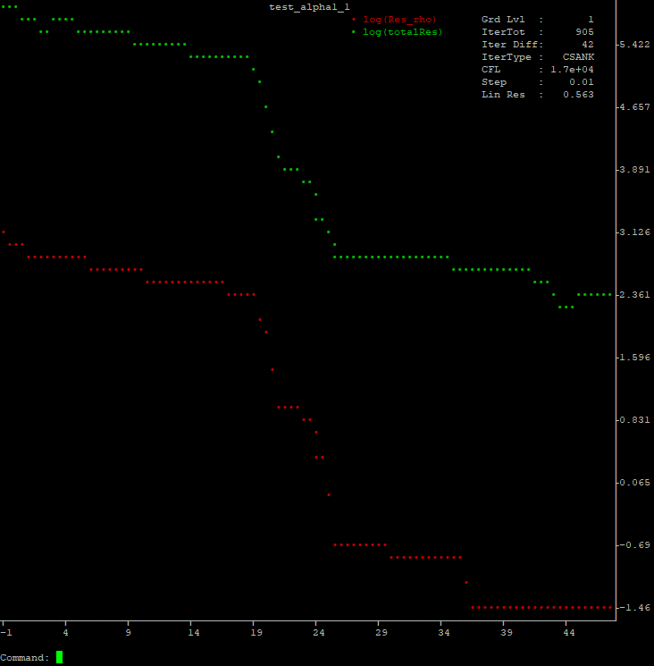

# adflow_util

This package provides some convenience functions for [ADflow](https://github.com/mdolab/adflow). It allows to:

1. Easily calculate a Polar sweep with ADflow.
2. Automatically create the **output** folder for ADflow.
3. Automatically restart ADflow if there is a solution available.
4. Plot realtime ADflow state variables in the terminal.
5. Plot ADflow state variables from a logfile


# Usage
## ADFLOW_UTIL
The following script sweeps through a list of Angle of Attacks (the full example can be found at *example/polar_sweep.py*).

``` python
from adflow_util import ADFLOW_UTIL

options = {
    'name': 'n0012_sweep',
    'resetAP': True,
}

aeroOptions = {
    'alpha': [1, 2, 3, 4],
    'reynolds': 3e6,
    # ...
    'evalFuncs': ['cl','cd', 'cmz']
}

solverOptions = {
    # Common Parameters
    'gridFile': 'n0012.cgns',
    'outputDirectory':'output',

    # Physics Parameters
    'equationType':'RANS',
    # ...
    'L2Convergence':1e-12,
}

au = ADFLOW_UTIL(aeroOptions, solverOptions, options)
au.run()
```
The dict **aeroOptions** holds all the variables that normally **baseclasses.AeroProblem** would. If one variable is a list, this is considered the sweep variable. All variables except **coefPol, cosCoefFourier, sinCoefFourier, momentAxis, solverOptions, evalFuncs** can be sweeped.

The dict **options** holds some ADFLOW_UTIL specific options. More about them can be found
[here](https://github.com/DavidAnderegg/adflow_util/blob/master/adflow_util/adflow_util.py#L52).

This script will generate a file called *n0012_sweep.out* with this content:
```
n0012_sweep

Aero Options
--------------  -----------
alpha           1, 2, 3, 4
...
evalFuncs       cl, cd, cmz
--------------  -----------


 RESULTS
  alpha          cd          cl         cmz    totalRes    iterTot
-------  ----------  ----------  ----------  ----------  ---------
      1  0.01011288  0.11602992  0.00066774  0.00085824        633
...
      4  0.01080607  0.46238766  0.00248672  0.00089012        541
```


It is also possible to have multiple sweep variables. But all must have the same length. There will be no cross calculation. For example, if you set **alpha = [0, 1]** and **reynolds = [5e6, 3e6]** there will be two simulations in total. The first with **alpha = 0**, **reynolds = 5e6** and the second with **alpha = 1**, **reynolds = 3e6**.


## adflow_plot
If this package was installed using pip, the command **adflow_plot** should be available in your terminal. To use it, simply type **adflow_plot -i yourADflowScript.py**. As this utility reads the stdout stream, it should work with all scripts as long as the ADflow option **printIterations** is **True**.

If you want to parallelize your ADflow calculation, simply add **-np number_of_cores** oder **-H list_of_nodes**. As a default, **mpirun** is used to start mpi. If you have a different installation of mpi, you can change it with **-mpi some_different_mpi_command**. Type **adflow_plot -h** to get a list of all available start options.


The output looks something like this:



If you want to see the raw ADflow output, you can list it at the top by entering **hlog number_of_lines**.

To close it, type **q** or **quit**.

Type **h** or **help** to get a list of all commands. type **h a_command** oder **help a_command** to get additional information about this specific command.

### Plot a logfile
If the inputfile does not end with **.py** it is assumed to be a logfile. The file is read continously with
the linux-command **tail -f**. This makes it possible to plot the variables allmost in realtime while
the script is executed on a cluster for example.


# Installation
Simply execute this command (if pip and git is installed)
```
pip install git+https://github.com/DavidAnderegg/adflow_util.git
```

# Limitations, Bugs and Ideas
As for now, this whole suite was only tested with steady simulations. Additionally, some terminals handle input keys differently and it might be possible, that for example ENTER ist not properly recognised. Please file a bug report so I can fix it as soon as possible.

If you find any bugs and/or you have ideas that I could add, file an issue on github or write me at andv@zhaw.ch.


# Acknowledgements
This package uses a modified version of **plotext**. The raw package is available at https://github.com/piccolomo/plotext.

The Naca0012 Grid in the example folder is from https://github.com/mdolab/MACH-Aero.
